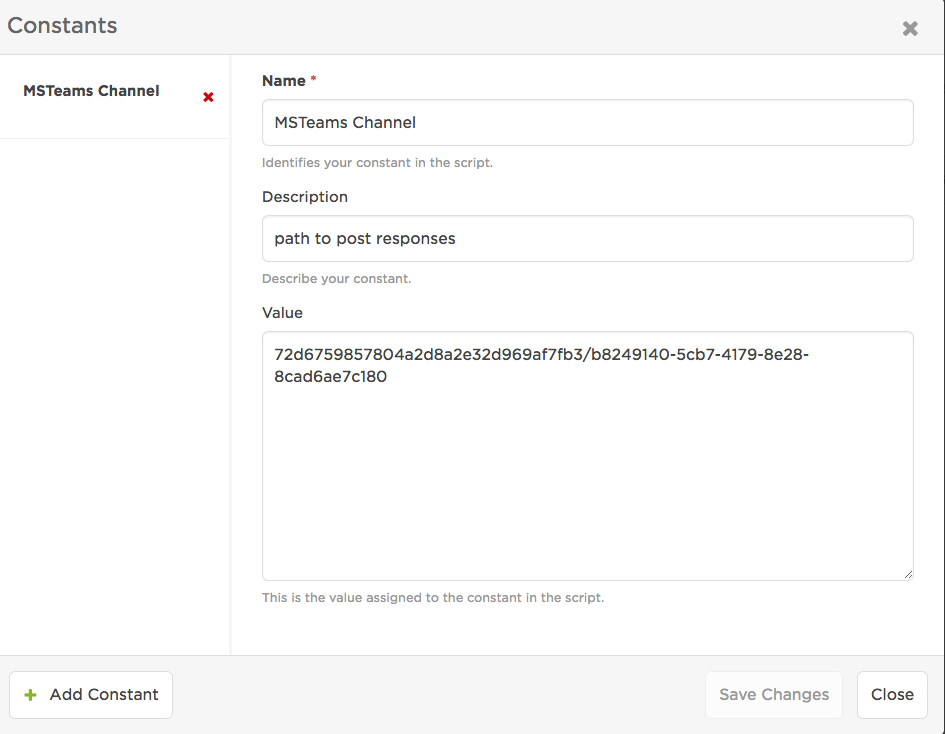

# xMatters MSTeams integration - Azure Bots as Service - 1.0
Stand alone MSTeams bot hosted by Azure

<kbd>
  
</kbd>

# Pre-Requisites
* Microsoft Azure Portal credentials.  Create Free credentials [HERE](https://azure.microsoft.com/en-us/free/search/?&WT.srch=1&WT.mc_id=AID631184_SEM_oUHhx2Yc&lnkd=Google_Azure_Brand&gclid=EAIaIQobChMIld67-dHT2gIVgqDsCh2ZuQJDEAAYASAAEgI2tfD_BwE)
* Microsoft Teams Account.  Create Free trial here (https://teamsdemo.office.com/)
* Microsoft Teams App Downloaded.  Download App here (https://teams.microsoft.com/downloads)
* xMatters account - If you don't have one, [get one](https://www.xmatters.com)!

# Files
* [ExampleCommPlan.zip](ExampleCommPlan.zip) - This is an example comm plan to help get started. 

# How it works
Once the bot is running on Azure, you can add it to your MS Teams Team Channels.  Once added, within a channel you can interact with the bot by typing @botxmatters [command]

<kbd>
  
</kbd>

# Installation
We will run through the following setup sequence:
1. Setup template Azure bots as a service in the Azure portal.
2. Test out the bot in the Web Chat & Chat Emulator.  Generic Command (no xMatters integration).
3. Test out the bot 1 on 1 in the MS Teams App.  Generic command (no xMatters integration).
4. Import the xMatters Communication Plan and configure.
5. Point the bot from step one to Github repo for xMatters bot.
6. Configure the bot with specific xMatters information.
7. Configure MS Teams Channel with connector and update xMatters configuration.
8. Test out the bot in the Web Chat & Chat Emulator.  xMatters commands.
19. Test out the bot 1 on 1 in the MS Teams app.  xMatters commands.
10. Use MS Teams App Studio in MS Teams to create an app manifest.  This manifest will be used to add the bot to Teams/channels.

## 1. Setup template Azure bot as service. 
New to Microsoft Bots?  The following are the references we will be utilizing to set everything up.
* Setup a sample bot with Bot Service (https://docs.microsoft.com/en-us/azure/bot-service/bot-service-quickstart)
* Test the sample Bot in Web Chat (https://docs.microsoft.com/en-us/azure/bot-service/bot-service-manage-test-webchat)
* Test the sample Bot in MS Teams with 1 on 1 chat. (https://docs.microsoft.com/en-us/microsoftteams/platform/concepts/bots/bots-test)
* In MS Teams use Teams App Studio to access your bot in Teams. Essentially, in Teams App Studio you will define a Manifest that points to the bot in step 1.  
https://docs.microsoft.com/en-us/microsoftteams/platform/get-started/get-started-app-studio
* A couple things of note:
The bot frameworkid is the same as the Microsoft AppID.  You will enter this in two places.  You can get the Microsoft AppID of the bot from the Azure console.
* Export the manifest and import it to a Team.  You will be able to @botname a command to bot in that team.
https://docs.microsoft.com/en-us/microsoftteams/platform/concepts/apps/apps-upload

1. Login to the Azure Portal and create a new resource.  Select AI - Cognitive Services - > Web App Bot

<kbd>
  
</kbd>

2. Enter the Web App Bot Information.  Click here to get a definition of the information required(https://docs.microsoft.com/en-us/azure/bot-service/bot-service-quickstart)

<kbd>
  
</kbd>

3. Bot Template - Choose Node.js and Form.

<kbd>
  
</kbd>

4. Click Create.  A number of new resources are created in the All resouces View.

<kbd>
  
</kbd>

## 2. Test out the bot in the Web Chat & Chat Emulator.  Generic Command (no xMatters integration).
1. In the Azure Portal, slect the All resources view.  Within that view, you should see the botxmatters (Web app Bot) item.

<kbd>
  
</kbd>

2. Click on it.

<kbd>
  
</kbd>

3. Click on the Web Chat item.

<kbd>
  
</kbd>

4. Enter the following command.
```
Hello, Bot!
```

5. The bot will return a question.  Answer the bot and continue with the dialog.  You have successfully tested the bot in the Web Chat.

6. Download the MS Teams Emulator and follow the instructions to install and configure from here (https://docs.microsoft.com/en-us/azure/bot-service/bot-service-debug-emulator)

7. Obtain the AppId and App Password from the Azure Portal in the bot Application Settings.

<kbd>
  
</kbd>

8. In the Emulator connect using the AppID and the App Password

<kbd>
  
</kbd>

9. Once connected, enter the following command.
Enter the following command.
```
Hello, Bot!
```

10. The bot will return a question.  Answer the bot and continue with the dialog.  You have successfully tested the bot in the Emulator.

## 3. Test out the bot 1 on 1 in the MS Teams App.  Generic command (no xMatters integration).
1. Use the following to test 1 on 1 in the MS Teams App. (https://docs.microsoft.com/en-us/microsoftteams/platform/concepts/bots/bots-test)

2. Once in the App in the 1 on 1 chat with the bot enter the following command.
```
Hello, Bot!
```
3. The bot will return a question.  Answer the bot and continue with the dialog.  You have successfully tested the bot in MS Teams.

<kbd>
  
</kbd>

## 4. Import the xMatters Communication Plan and configure.
1. Import a communication plan (link: http://help.xmatters.com/OnDemand/xmodwelcome/communicationplanbuilder/exportcommplan.htm)

2. Copy the /engage Inbound Integration Endpoint.

<kbd>
  
</kbd>

<kbd>
  
</kbd>

3. Create the "MSTeams Channel" Constant.

<kbd>
  
</kbd>

4. Create the "MSTeams" Endpoint.

<kbd>
  
</kbd>


## 5. Configure the bot with specific xMatters information.


## 6. Configure MS Teams Channel with connector and update xMatters configuration.


## 7. Test out the bot in the Web Chat & Chat Emulator.  xMatters commands.


## 9. Test out the bot 1 on 1 in the MS Teams app.  xMatters commands.


## 10. Use MS Teams App Studio in MS Teams to create an app manifest.  This manifest will be used to add the bot to Teams/channels.

1. In MS Teams use Teams App Studio to access your bot in Teams. Essentially, in Teams App Studio you will define a Manifest that points to the bot in step 1.  
https://docs.microsoft.com/en-us/microsoftteams/platform/get-started/get-started-app-studio

2.Export the manifest and import it to a Team.  You will be able to @botname a command to bot in that team.
https://docs.microsoft.com/en-us/microsoftteams/platform/concepts/apps/apps-upload


# Testing
This integration has had some testing but more is required, to do this follow these steps in windows:

1. download the msteams botframework emulator

	https://github.com/Microsoft/BotFramework-Emulator/releases

2. Download the ngrok executable to your local machine.

	https://ngrok.com/

3. Open the emulator's App Settings dialog, enter the path to ngrok, select whether or not to bypass ngrok for local addresses, and click Save.

4. connect to the url (localhost if testing locally)

	https://hosted-site.com/api/messages

5. type in help to get the list of commands

# Development

To run a dev environment locally run:

```

npm run dev

```

This will automatically restart the app when any files are changed.


